# Database Design — Corrected ERD

This revises the ERD you shared, resolving every issue raised in the design
review. It is a **design document for Chapter 3**, not a change to the
running prototype — see `docs/database/schema.sql` for the runnable DDL if
you later decide to build toward it, and the note at the bottom of this file
for how that would relate to the current SQLite schema in `app.py`.

## What changed, and why (map back to the review)

| # | Issue raised | Fix applied |
|---|---|---|
| 1 | Repeated FKs (`ASSESSMENT_RESULTS.condition_id`/`risk_level_id` also reachable via `rule_id`) looked redundant | Kept deliberately, now documented as **point-in-time snapshots**: a patient's historical result must not silently change if an admin later edits a rule's condition/risk-level mapping. Same rationale documented once, applies everywhere the pattern repeats (`RESULT_RECOMMENDATIONS`, `ASSESSMENT_RESULTS`). |
| 2 | `ASSESSMENT_RESULTS` granularity was ambiguous (one row per assessment, or per matched rule?) — and there was no explicit aggregation step | Explicitly one row **per matched rule** (an assessment can trigger several). Added `ASSESSMENTS.final_risk_level_id`, populated as `MAX(severity_rank)` across that assessment's `ASSESSMENT_RESULTS` rows — the single number actually shown to the patient. `RISK_CLASSIFICATIONS` (the ML opinion) never overwrites this; the rule engine stays the safety authority, matching the framing already used in your own code comments. |
| 3 | `REFERRALS` keyed off `result_id` could produce duplicate referral rows when multiple rules fire at once | Re-keyed to `assessment_id` with a `UNIQUE` constraint — exactly one referral per assessment, generated from the aggregated `final_risk_level_id`, not per individual rule match. |
| 4 | `USERS` had no way to distinguish barangay health workers from residents, despite both being named as primary users in your SOP | Added `user_type CHECK (user_type IN ('resident','health_worker'))` to `USERS`. |
| 5 | `HEALTHCARE_FACILITIES.service_available` was a flat field despite the schema otherwise normalizing types out | Replaced with `SERVICES` + `FACILITY_SERVICES` (many-to-many junction), consistent with how `FACILITY_TYPES` is already handled. |
| — | `EXPERT_RULES` had no field to actually hold a rule's scoring weight or emergency-override behavior | Added `weight` and `is_emergency_override` — without these the table can't represent the rule engine's actual logic (see `docs/rule_base.md`), only its metadata. |
| — | `ML_MODELS` tracked *that* a model was trained but not how well it performed | Added `sample_size`, `cv_folds`, `cv_accuracy` — persists the honest cross-validated metric per model version, so accuracy claims survive retraining and are attributable to a specific model row (`ml_module.evaluate_model()` already computes exactly this). |
| — | `SYMPTOM_TERMS.normalized_term` duplicated what should be `SYMPTOMS`' own canonical key | Moved the canonical machine key onto `SYMPTOMS.symptom_key` (e.g. `difficulty_breathing`); `SYMPTOM_TERMS` now only holds the Bisaya term + which symptom it maps to. |
| — | The ERD showed a separate `ADMIN` table, but the implemented database has no such table | Removed the separate `ADMIN` entity. Administrator accounts are rows in `USERS` whose `role` is `admin`; administrative foreign keys reference that shared account table. |

## Entity-relationship diagram

```mermaid
erDiagram
    USERS ||--o{ EXPERT_RULES : authors
    USERS ||--o{ HEALTH_GUIDELINES : authors
    USERS ||--o{ RECOMMENDATIONS : authors
    USERS ||--o{ ML_MODELS : registers
    USERS ||--o{ HEALTHCARE_FACILITIES : manages

    USERS ||--o{ ASSESSMENTS : submits
    USERS ||--o{ FEEDBACKS : submits

    FACILITY_TYPES ||--o{ HEALTHCARE_FACILITIES : categorizes
    HEALTHCARE_FACILITIES ||--o{ FACILITY_SERVICES : offers
    SERVICES ||--o{ FACILITY_SERVICES : "offered via"
    HEALTHCARE_FACILITIES ||--o{ REFERRALS : "referred to"

    CONDITIONS ||--o{ HEALTH_GUIDELINES : "documented by"
    CONDITIONS ||--o{ EXPERT_RULES : classified_by
    CONDITIONS ||--o{ RECOMMENDATIONS : "advises on"
    CONDITIONS ||--o{ ASSESSMENT_RESULTS : identified

    RISK_LEVELS ||--o{ EXPERT_RULES : "assigned by"
    RISK_LEVELS ||--o{ RECOMMENDATIONS : scopes
    RISK_LEVELS ||--o{ ASSESSMENT_RESULTS : records
    RISK_LEVELS ||--o{ RISK_CLASSIFICATIONS : predicts
    RISK_LEVELS ||--o{ ASSESSMENTS : "finalizes as"

    SYMPTOMS ||--o{ SYMPTOM_TERMS : "spoken as"
    SYMPTOMS ||--o{ RULE_SYMPTOMS : required_by
    SYMPTOMS ||--o{ ASSESSMENT_SYMPTOMS : detected_in

    EXPERT_RULES ||--o{ RULE_SYMPTOMS : requires
    EXPERT_RULES ||--o{ ASSESSMENT_RESULTS : fires

    HEALTH_GUIDELINES ||--o{ RECOMMENDATIONS : backs

    RECOMMENDATIONS ||--o{ RESULT_RECOMMENDATIONS : "shown as"

    ML_MODELS ||--o{ RISK_CLASSIFICATIONS : produces

    ASSESSMENTS ||--o{ ASSESSMENT_SYMPTOMS : contains
    ASSESSMENTS ||--o{ ASSESSMENT_RESULTS : yields
    ASSESSMENTS ||--o{ RISK_CLASSIFICATIONS : yields
    ASSESSMENTS ||--o| REFERRALS : "resolves to"
    ASSESSMENTS ||--o{ FEEDBACKS : "rated by"

    ASSESSMENT_RESULTS ||--o{ RESULT_RECOMMENDATIONS : includes

    USERS {
        int user_id PK
        string full_name
        string username
        string password_hash
        string phone
        string email
        string address
        string gender
        string age
        string role "resident | health_worker | admin"
        datetime created_at
    }

    FACILITY_TYPES {
        int facility_type_id PK
        string type_name
    }

    HEALTHCARE_FACILITIES {
        int facility_id PK
        int admin_user_id FK "USERS.role = admin"
        int facility_type_id FK
        string facility_name
        string address
        real latitude
        real longitude
        string contact_number
        datetime created_at
    }

    SERVICES {
        int service_id PK
        string service_name
    }

    FACILITY_SERVICES {
        int facility_service_id PK
        int facility_id FK
        int service_id FK
    }

    CONDITIONS {
        int condition_id PK
        string condition_name
        string condition_type
        string description
    }

    RISK_LEVELS {
        int risk_level_id PK
        string level_name
        string description
        int severity_rank "unique, low to high"
    }

    SYMPTOMS {
        int symptom_id PK
        string symptom_key "unique machine key, e.g. difficulty_breathing"
        string symptom_name
        string description
    }

    SYMPTOM_TERMS {
        int term_id PK
        int symptom_id FK
        string bisaya_term
    }

    EXPERT_RULES {
        int rule_id PK
        int admin_user_id FK "USERS.role = admin"
        int condition_id FK
        int risk_level_id FK
        string rule_name
        string rule_description
        int weight "score contribution when this rule fires"
        boolean is_emergency_override "forces final_risk_level_id to High"
        boolean is_active
        datetime created_at
    }

    RULE_SYMPTOMS {
        int rule_symptom_id PK
        int rule_id FK
        int symptom_id FK
        boolean is_required
    }

    HEALTH_GUIDELINES {
        int guideline_id PK
        int admin_user_id FK "USERS.role = admin"
        int condition_id FK
        string guideline_title
        string guideline_content
        string source
        datetime created_at
    }

    RECOMMENDATIONS {
        int recommendation_id PK
        int admin_user_id FK "USERS.role = admin"
        int condition_id FK
        int risk_level_id FK
        int guideline_id FK "nullable"
        string recommendation_text
        string action_type
        datetime created_at
    }

    ML_MODELS {
        int model_id PK
        int admin_user_id FK "USERS.role = admin"
        string model_name
        string version
        string algorithm
        datetime trained_at
        int sample_size
        int cv_folds
        real cv_accuracy "cross-validated, not training accuracy"
        boolean is_active
    }

    ASSESSMENTS {
        int assessment_id PK
        int user_id FK
        string raw_symptom_input
        string language
        string location_text
        real latitude
        real longitude
        int age_snapshot
        string gender_snapshot
        int final_risk_level_id FK "aggregated rule-engine verdict; nullable until processed"
        datetime assessment_date
        string status
    }

    ASSESSMENT_SYMPTOMS {
        int assessment_symptom_id PK
        int assessment_id FK
        int symptom_id FK
        string extracted_text
        real confidence_score
    }

    ASSESSMENT_RESULTS {
        int result_id PK
        int assessment_id FK
        int condition_id FK "snapshot of rule's condition at match time"
        int risk_level_id FK "snapshot of rule's risk level at match time"
        int rule_id FK
        string explanation
        real confidence_score
        datetime generated_at
    }

    RESULT_RECOMMENDATIONS {
        int result_recommendation_id PK
        int result_id FK
        int recommendation_id FK
    }

    RISK_CLASSIFICATIONS {
        int classification_id PK
        int assessment_id FK
        int model_id FK
        int risk_level_id FK "ML's own opinion, supplementary only"
        real confidence_score
        datetime classified_at
    }

    REFERRALS {
        int referral_id PK
        int assessment_id FK "unique: one referral per assessment"
        int facility_id FK
        string referral_reason
        string referral_priority
        string referral_status
        datetime referral_date
    }

    FEEDBACKS {
        int feedback_id PK
        int user_id FK
        int assessment_id FK
        int usability_score
        int accuracy_score
        int accessibility_score
        string comments
        datetime submitted_at
    }
```

## Relationship to the current prototype

The running system (`app.py`'s `init_db()`) uses a single `users` table for
resident and administrator accounts. The `role` column distinguishes them;
there is no separate `ADMIN` table. The prototype implements
`users`, `assessments`, `facilities`, `guidelines`, `activity_logs`,
`password_reset_tokens`, `login_attempts`, `questionnaire_responses`, and
`questionnaire_answers`, plus the database-backed rule-base tables
`RISK_LEVELS`, `CONDITIONS`, `SYMPTOMS`, `SYMPTOM_TERMS`, `EXPERT_RULES`, and
`RULE_SYMPTOMS`. Some entities in this conceptual target ERD (for example,
ML model history and normalized referral/result tables) are not yet runtime
tables. Keep this distinction explicit in the methodology chapter: the
diagram documents the broader target design, while the table list above
describes the current implementation.

`schema.sql` is a SQLite DDL representation of the conceptual target design;
it is not run by the application at startup.
